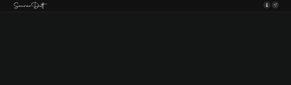

# sauravDutt 
   
sauravDutt, or [sauravdutt.tech](https://www.sauravdutt.tech/) is my portfolio website created by  :-  
-> <b>React js</b>
-> <b>Node</b>
-> <b>Express</b>
-> <b>Mongo DB</b> 
-> <b>Also some other useful react libraries</b> 
Designed with a mobile first approach. This is also my last Javascript Web Dev project.

### `sauravdutt.tech`

My portfolio website includes the following :-  

<b>Info</b> :-  
A little about me !! - 
“The function of good software is to make the complex appear to be simple.” - Grady Booch. I am a self taught web developer and a learner, I like to research about latest tech, new frameworks and polish my skills. I have an insatiable curiosity for AI – particularly deep learning – applications and their potential to change the technology landscape.

<b>Posts</b> :-  
Posts are like bolgs on subjects I am studying in my bachelor's. Some of the posts are on the following topics :- 
<b>Artificial Neural Network</b> , <b>Data Analytics</b> , <b>Internet Of Things </b> and <b>Drone Tech</b>.  
The users (trafic on my website) can read posts, add comments and like.

<b>Feeds</b> :-  
Feeds or feed back are utilities for the user to add and brouse past feeds, the users can post and comment endless amount of feeds. There's no Authentication just a small email varification and the user is good to go!! 

<b>Settings</b> :-  
By default the theme of the website(or the web application) will be Dark, but there will be a toggle switch in Settings -> Themes -> Toggle Switch, with two modes Dark and light (or Night and Day).

### `Release`

The website or the web application will be live by the 2nd of Octuber,2020. Till then the development prototype is available at [sd.sauravdutt.tech](https://sd.sauravdutt.tech/) This is just a development prototype deployed for testing purpose only.

## Available Scripts

In the project directory, you can run:

### `npm start`

Runs the app in the development mode. 
Open [http://localhost:3000](http://localhost:3000) to view it in the browser.

The page will reload if you make edits. 
You will also see any lint errors in the console.

### `npm test`

Launches the test runner in the interactive watch mode. 
See the section about [running tests](https://facebook.github.io/create-react-app/docs/running-tests) for more information.

### `npm run build`

Builds the app for production to the `build` folder. 
It correctly bundles React in production mode and optimizes the build for the best performance.

The build is minified and the filenames include the hashes. 
Your app is ready to be deployed!

See the section about [deployment](https://facebook.github.io/create-react-app/docs/deployment) for more information.

